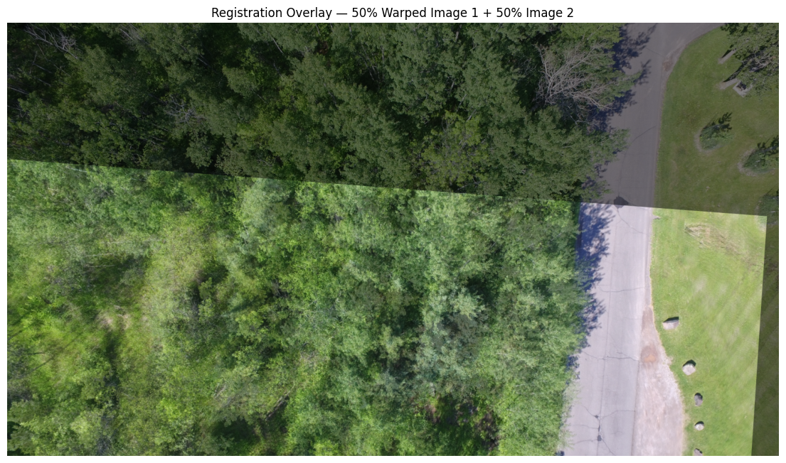
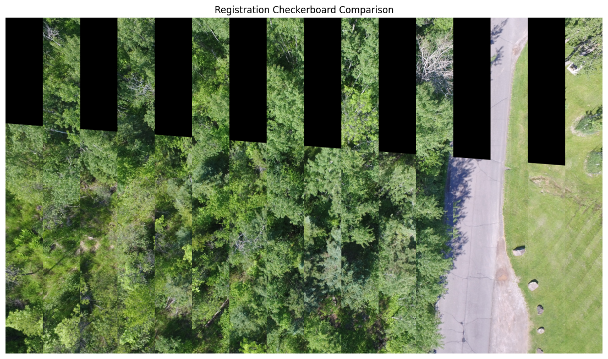
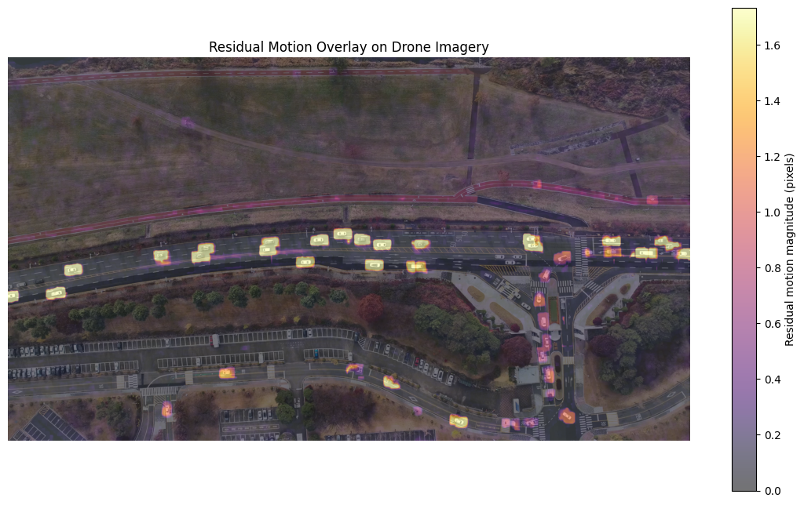
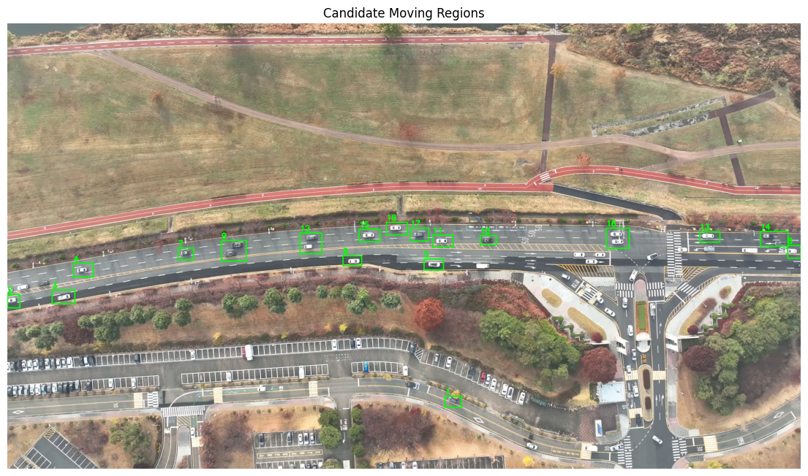

# Drone Computer Vision with OpenCV

Two advanced classical-computer-vision projects exploring **spatial registration** and **temporal motion analysis** in drone imagery.

The repository focuses on interpretable OpenCV workflows rather than pretrained object detectors. Each notebook develops a complete analysis pipeline, evaluates its assumptions, and documents where the method succeeds and where it breaks down.

## Projects

| Project | Focus | Core techniques |
|---|---|---|
| [1. Drone Image Registration](#1-drone-image-registration) | Align overlapping aerial photographs and diagnose registration failure | SIFT, FLANN, Lowe's ratio test, RANSAC, homography, perspective warping |
| [2. Drone Ego-Motion and Moving-Object Analysis](#2-drone-ego-motion-and-moving-object-analysis) | Separate camera motion from independently moving roadway traffic | Shi-Tomasi, Lucas-Kanade, RANSAC affine estimation, Farnebäck flow, morphology, contours |

---

## 1. Drone Image Registration

[](https://colab.research.google.com/github/fish417913/drone-computer-vision-opencv/blob/main/notebooks/01_drone_image_registration.ipynb)

**Notebook:** [`notebooks/01_drone_image_registration.ipynb`](notebooks/01_drone_image_registration.ipynb)

### Objective

Register two overlapping drone photographs taken from slightly different viewpoints and evaluate whether a single global homography is adequate across the full scene.

### Techniques

- SIFT keypoint detection and 128-dimensional descriptors
- FLANN nearest-neighbor matching
- Lowe's ratio test
- RANSAC outlier rejection
- Homography estimation
- Perspective warping
- Reprojection-error analysis
- Spatial match-distribution diagnostics
- Overlap-aware residual comparison

### Key results

- ~19,500 SIFT keypoints detected per image
- 369 matches survived Lowe's ratio test
- 232 RANSAC inliers
- 62.87% inlier ratio
- Mean reprojection error: **0.549 px**
- Median reprojection error: **0.354 px**

### Main finding

The estimated homography aligned the approximately planar roadway very well, while forested regions showed substantial residual misalignment. The result demonstrates an important limitation of a single global homography: elevated 3D structures such as tree canopy introduce parallax and may not be represented accurately by one planar projective transformation.

<p align="center">
  
  
</p>

---

## 2. Drone Ego-Motion and Moving-Object Analysis

[](https://colab.research.google.com/github/fish417913/drone-computer-vision-opencv/blob/main/notebooks/02_drone_ego_motion_and_object_detection.ipynb)

**Notebook:** [`notebooks/02_drone_ego_motion_and_object_detection.ipynb`](notebooks/02_drone_ego_motion_and_object_detection.ipynb)

### Objective

Estimate residual drone-camera ego-motion and isolate independently moving roadway traffic using sparse and dense optical flow.

### Techniques

- Shi-Tomasi feature detection
- Pyramidal Lucas-Kanade optical flow
- RANSAC partial-affine estimation
- Full-video ego-motion analysis
- Camera-motion compensation
- Farnebäck dense optical flow
- Adaptive residual-motion thresholding
- Morphological opening and closing
- Contour extraction and area filtering
- Motion-region bounding boxes

### Key results

**Representative frame pair**

- 500 / 500 features successfully tracked
- 453 / 500 dominant-motion RANSAC inliers
- 90.6% inlier rate
- Mean dominant-motion displacement: **0.161 px**
- Mean RANSAC-outlier displacement: **3.655 px**

**Across all 299 frame transitions** at the 1920 × 1080 analysis resolution

- Mean horizontal motion: **0.0350 px**
- Mean vertical motion: **-0.0131 px**
- Mean rotation: **0.002922°**
- Median RANSAC inlier ratio: **94.8%**

**Residual dense optical flow**

- Median residual magnitude: **0.0867 px**
- 95th percentile: **0.1926 px**
- 99th percentile: **1.7347 px**
- Maximum residual magnitude: **3.7897 px**

**Full-video candidate motion regions**

- Median: **16 regions/frame**
- Mean: **15.90 regions/frame**
- Range: **12–20 regions/frame**

### Main finding

The drone footage was already highly stabilized. Rather than forcing an unnecessary stabilization step, the estimated ego-motion was used to compensate residual camera movement before dense optical-flow analysis. High residual-motion regions corresponded primarily to moving roadway vehicles, showing that classical OpenCV methods can isolate independently moving traffic without a trained semantic object detector.

The detected boxes should be interpreted as **candidate moving regions**, not validated vehicle identities. Detections are frame-by-frame, so boxes can flicker or merge when neighboring vehicles produce connected motion regions.

<p align="center">
  
  
</p>

---

## Technical takeaways

- Feature correspondence can estimate geometric relationships between camera views.
- RANSAC is useful for finding the dominant geometric or motion consensus while rejecting inconsistent observations.
- Low reprojection error does not guarantee globally accurate registration when feature matches are spatially concentrated.
- Apparent image motion must be separated from camera ego-motion before interpreting motion as independent object movement.
- Residual motion is not synonymous with a semantic object class; parallax, shadows, vegetation, occlusion, and tracking error can also produce residuals.
- Classical computer-vision methods remain useful for interpretable, geometry-driven drone-analysis workflows.

## Data sources and attribution

The source imagery and video are **not stored in this repository**. The notebooks retrieve public datasets at runtime.

- **Tutorial 1:** [Brighton Beach drone dataset](https://github.com/pierotofy/drone_dataset_brighton_beach), maintained by Piero Toffanin. The source repository is distributed under the [BSD 2-Clause License](https://github.com/pierotofy/drone_dataset_brighton_beach/blob/master/LICENSE).
- **Tutorial 2:** [The DRIFT Open Dataset](https://github.com/AIxMobility/The-DRIFT), licensed under [CC BY 4.0](https://github.com/AIxMobility/The-DRIFT/blob/main/LICENSE).
  - Lee, H., Hong, S., Song, J., Cho, H., Jin, Z., Kim, B., Jin, J., Im, J., Noh, B., & Yeo, H. (2025). *DRIFT open dataset: A drone-derived intelligence for traffic analysis in urban environment*. [arXiv:2504.11019](https://arxiv.org/abs/2504.11019).

## Tools

- Python
- OpenCV
- NumPy
- Matplotlib
- Google Colab

## Reproducibility

The notebooks are designed for Google Colab and download the required public data during execution. For a local environment, install the core Python dependencies with:

```bash
pip install -r requirements.txt
```

Generated videos and downloaded datasets are intentionally excluded from version control.

## Repository structure

```text
drone-computer-vision-opencv/
├── README.md
├── requirements.txt
├── .gitignore
├── assets/
│   ├── tutorial_1_registration_overlay.png
│   ├── tutorial_1_registration_checkerboard.png
│   ├── tutorial_2_residual_motion_heatmap.png
│   └── tutorial_2_final_bounding_box_detection_frame.png
└── notebooks/
    ├── 01_drone_image_registration.ipynb
    └── 02_drone_ego_motion_and_object_detection.ipynb
```
